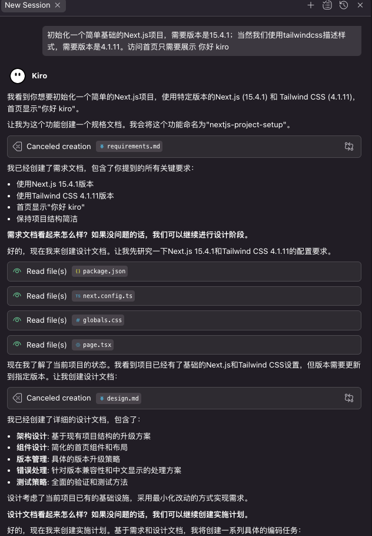

## CodeWhisperer 预览和初始发布

2022年6月：Amazon CodeWhisperer 预览版发布。亚马逊网络服务（AWS）发布了Amazon CodeWhisperer的预览版。在最初阶段，该工具支持Java、JavaScript和Python，并可通过各种集成开发环境（IDE）使用，如JetBrains系列（IntelliJ、PyCharm和WebStorm）、Visual Studio Code、AWS Cloud9和AWSLambda控制台。

- 核心定位： AI代码生成器，直接在IDE中提供代码建议。
- 初始能力： 支持在VS Code、JetBrains IDEs、AWS Cloud9等环境中为Python, Java, 和
  JavaScript提供代码补全。这是亚马逊在AI辅助编码领域的首次重要亮相。

## CodeWhisperer 正式发布和扩展

2023年4月13日：Amazon CodeWhisperer 正式发布 (GA)。CodeWhisperer正式发布。此次发布为所有开发人员推出了免费的“个人版”，同时为企业提供了包含额外管理功能的付费“专业版”。

- 正式版本还将语言支持范围大幅扩展，在原有Python、Java、JavaScript、TypeScript和C#的基础上，增加了对Go、Rust、PHP、Ruby、Kotlin、C、C++、Shell脚本、SQL和Scala的支持。

## CodeWhisperer 持续发展和新功能

2023年8月：AWS 收购 Fig.io

- 核心能力： Fig是一个广受欢迎的命令行工具，为终端带来了IDE般的自动补全和协作功能。
- 战略意图：
  这次收购清晰地表明，亚马逊不仅关注IDE内的编码体验，同样重视开发者日常工作中不可或缺的命令行/终端（CLI）体验。

2023年10月： 宣布推出CodeWhisperer定制功能的预览版，允许组织根据其内部库和最佳实践来定制代码建议。

## CodeWhisperer 与Amazon Q Developer集成

2024年4月：Amazon Q Developer 发布，整合所有AI编码能力

- 品牌统一： 亚马逊将旗下所有面向开发者的AI工具统一整合到 Amazon Q 品牌下。
- 功能继承：
  - IDE中的 CodeWhisperer 成为 Amazon Q 的核心代码生成功能。
  - 命令行中的 CodeWhisperer for Command Line (源于“Kiro”/Fig) 也被并入 Amazon Q，成为其在终端中的形态。
- 最终形态： 亚马逊最终形成了一个统一的AI助手 Amazon Q
  Developer，它既能存在于IDE中帮助编写应用代码，也能存在于命令行中帮助执行系统管理和脚本编写任务。

## Kiro 原生AI编辑

一个新的 agentic IDE。Kiro 由 AWS 内部一个规模虽小但目标明确的团队构建和运营。我们选择“Kiro”（发音与“hero”押韵）这个名字，是因为它有多种含义，其中之一代表着一个勤奋且永不放弃的人。Kiro 这个名字体现了我们的北极星：快速行动，不懈迭代，为所有人提供卓越的 AI 驱动开发体验。我们很期待看到您用 Kiro 构建出色的产品。

1. Spec驱动开发（Spec-driven Development） 

Kiro把“specs”（规范文档）作为开发的核心。你只需输入一句需求，Kiro会自动生成详细的用户故事、验收标准（EARS格式）、技术设计文档（如数据流图、接口、数据库结构、API端点）等。这种方式让需求、设计和实现高度一致，减少了传统AI编辑器中“只会写代码但缺乏全局把控”的问题。

2. Hooks自动化机制 

Kiro的“hooks”类似于有经验的开发者在你开发过程中自动帮你补全遗漏、执行重复性任务。例如：
• 保存React组件时自动更新测试文件
• 修改API时自动刷新README
• 提交前自动做安全扫描
这些自动化操作可以自定义，极大提升团队协作和代码质量。

3. 任务与需求全链路追踪 

Kiro会自动把每个开发任务与需求、设计文档关联起来，生成详细的任务清单（包括单元测试、集成测试、响应式设计、可访问性等），并按依赖顺序排列。这样你可以逐步推进开发，随时追溯每个功能的来龙去脉，减少遗漏和返工。

4. 规范与代码实时同步 

Kiro的specs和代码是实时同步的。你可以让Kiro根据最新代码自动更新specs，或者手动刷新，保证文档和实现始终一致，解决了传统AI编辑器“文档与代码脱节”的痛点。

5. 生产级开发体验 

Kiro不仅支持“vibe coding”（快速原型），更强调如何把原型安全、规范地推向生产环境。它内置了MCP协议、插件兼容、团队协作、代码审查等生产级特性。

6. 兼容VS Code生态 

Kiro基于Code OSS开发，支持VS Code的设置和Open VSX插件，方便开发者无缝迁移。

相比之下，Cursor等AI编辑器更偏重于“AI辅助写代码”和“对话式编程”，但在需求梳理、设计文档、任务追踪、自动化规范等方面没有Kiro这么系统和深入。

如果你追求从需求到生产的全流程规范化、自动化和团队协作，Kiro会是更合适的选择。如果只是想要AI帮你写代码、查bug，Cursor等工具也能满足需求。
